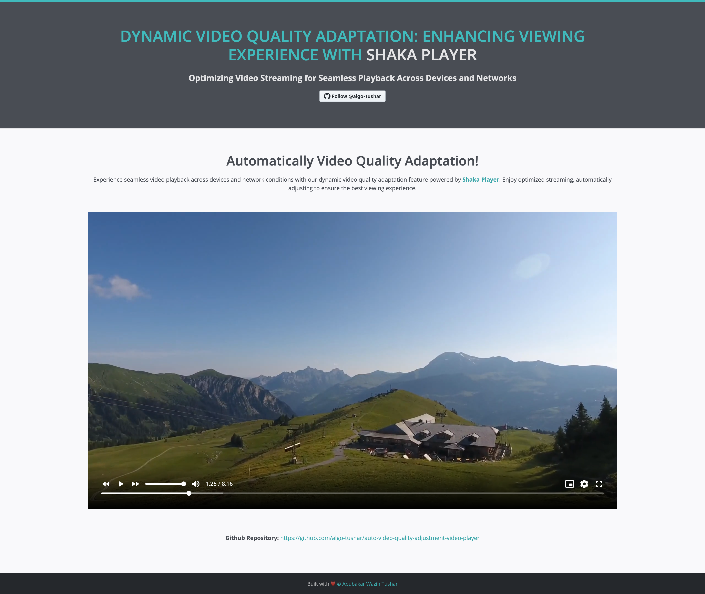
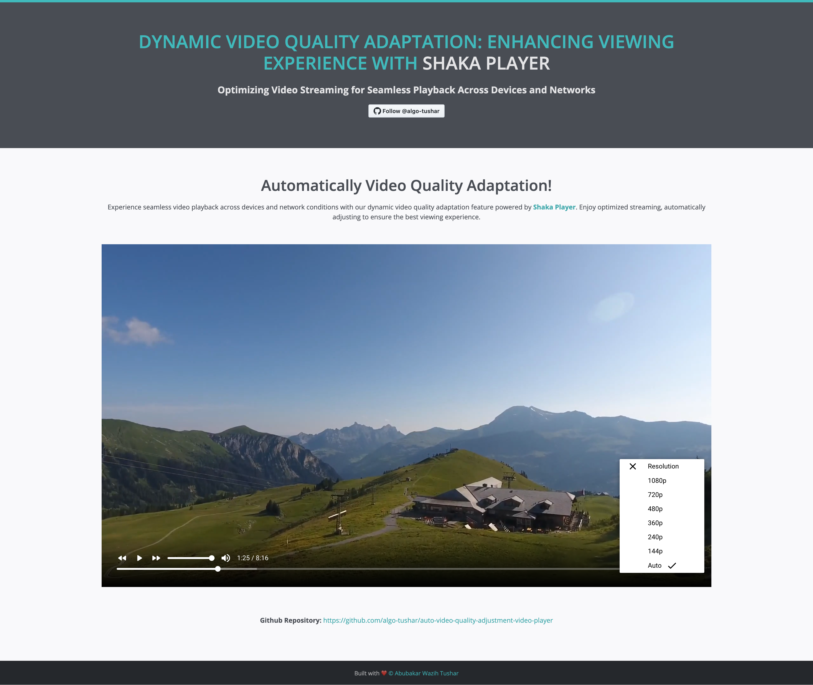

# Automatically Video Quality Adjustment Video Player using Shaka Player

This project showcases an adaptive video player using Shaka Player, which dynamically adjusts video quality based on network conditions. Shaka Player provides a seamless viewing experience by automatically switching between different video qualities (bitrates) to ensure smooth playback.

## Requirements

To use this video player, you need to convert your video files to either DASH (.mpd) or HLS (.m3u8) format. You can utilize the [PHP-FFmpeg-multi-quality-video-conversion-and-encoding-HLS-DASH](https://github.com/algo-tushar/PHP-FFmpeg-multi-quality-video-conversion-and-encoding-HLS-DASH) repository for converting videos to the required formats.

## Usage

1. Clone this repository:

    ```bash
    git clone https://github.com/algo-tushar/auto-video-quality-adjustment-video-player
    ```

2. Convert your video files to DASH or HLS format using the PHP-FFmpeg tool mentioned above.

3. Place the converted video files in the appropriate directory (e.g., `videos/`).

4. Initialize a local server to host the project files. You can use any HTTP server of your choice (e.g., Apache, Nginx).

5. Access the project via a web browser and enjoy adaptive video playback!

## Screenshots


*Player Demo*


*Player Quality Settings*

## Contributing

Contributions are welcome! If you encounter any issues or have suggestions for improvements, feel free to open an issue or submit a pull request.

## License

This project is licensed under the [MIT License](LICENSE).
